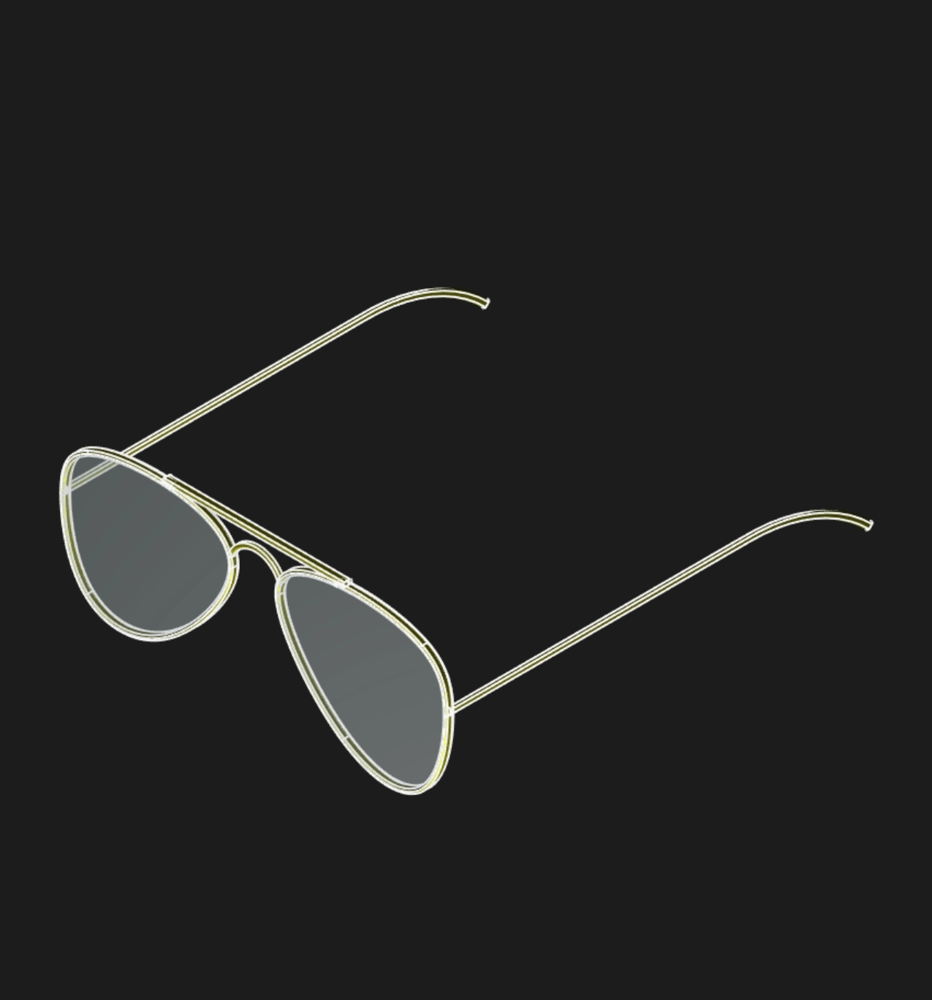

# Aviator Frame Toolkit for Zoo Remix Challenge

This project is a demonstration of high-fidelity, organic CAD design in KCL, centered on the iconic **Aviator Frame**. Rather than simply delivering a static model, the goal was to build an **Extensible Frame Toolkit**—a collection of "toolboxes" that other designers can use out of the box to solve common engineering hurdles in KCL.

## Key Innovations & Toolboxes

*   **The B-Spline Library (`lib_bspline.kcl`):** To capture the subtle, organic "teardrop" of the classic aviator, I implemented a custom **periodic cubic B-Spline library**. This allows for **C2-continuous curves** (mathematically smooth) that standard lines and arcs cannot achieve. By defining a low-fidelity "control cage," the library generates high-fidelity, automotive-grade surfaces automatically.
*   **3D Mirroring "Polyfill":** As of at the time of submission, KCL lacked a native 3D mirror tool (since then it has been added). I solved this by engineering a **coordinate-system-level mirroring toolkit**. By mathematically reflecting the workspace (planes) instead of the geometry, I achieved perfect symmetry and interactivity across the center line without duplicating code or manually calculating every vertex.
*   **Parametric Assembly:** The design is fully interactive. The "Master Cage" in `main.kcl` allows a user to tune the organic lens shape in real-time, with the symmetric 3D rims, glass lenses, and gold-metallic frame updating instantly.
*   **Visual Polish:** Leverages advanced `appearance` properties, including light-blue glass transparency (`opacity: 40`) and polished gold metallic finishes (`metalness: 100`, `roughness: 90`).

## Philosophy of Remixability

My primary goal was to provide **utility over variety**. Instead of just making a pair of glasses for people to remix, I wanted to provide the "Legos" of advanced KCL design. By providing standalone libraries for splines and symmetry, I am giving the community the tools they need to build their own organic, symmetric products—whether they are building eyewear, furniture, or vehicles.

## See it in Action: Interactive Tuning

To experience the power of the B-Spline "Control Cage," open **`aviator_lens.kcl`** in the Zoo Modeling App. 

1.  **Enable the Sketcher:** Select the `cage` sketch.
2.  **Tune the Shape:** Drag the control points in real-time.
3.  **Watch the Magic:** The high-fidelity smooth curve and 3D lens will update instantly as you manipulate the low-fidelity cage.

This demonstration shows how code-native CAD can bridge the gap between rough ideation and precise, organic manufacturing.

---
Built with [Zoo's KittyCAD Language (KCL)](https://zoo.dev)
